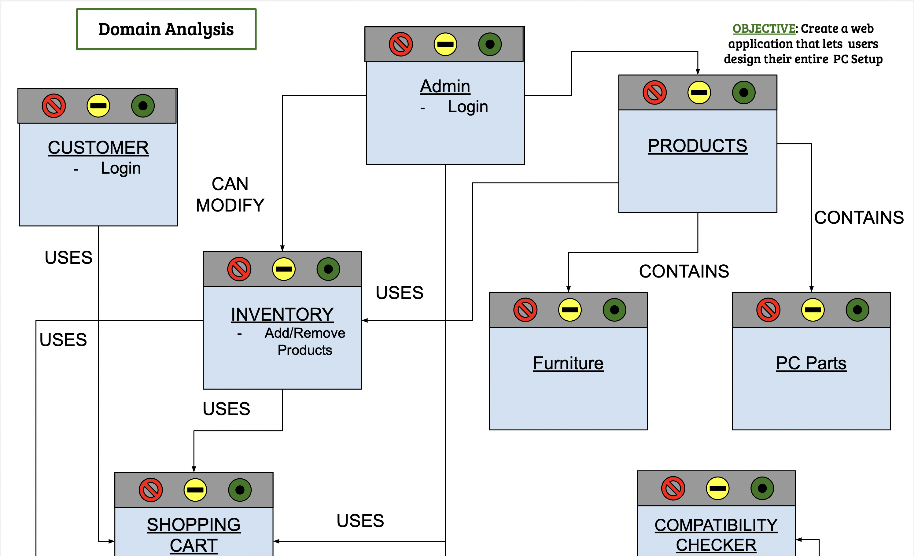
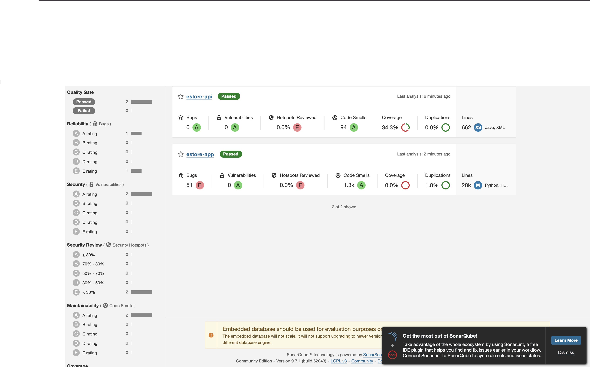

# PROJECT Design Documentation

## Team Information
* Team name: Studs
* Team members
  * Ian Aiken
  * Key'Mon Jenkins
  * Nate Hall
  * Zachary Coelho
  * Kwame Boamah

## Executive Summary

Create a web store that allows consumers to purchase all the needed parts to build thier own, repair, or upgrade thier custum PC.

### Purpose

- Our e-store provides an easier way for consumers to shop PC parts.
- Our main focus is ensuring that all parts within our part buddles are fully compatable with each other.
- We also plan to have various bundle packs for customers to chooses from.

### Glossary and Acronyms

| Term | Definition |
|------|------------|
| SPA | Single Page |

## Requirements

In this single page application we have developed several different webpages that have been routed to create a webstore to buy assorted computer parts. 

These webpages include a Login, Inventory, Parts, Parts Search and Cart.

The Login webpage dictgates the formating of the site presented. If the user is admin they would have acees the inventory feature, but all other users login into a site where this feature isn't presented.

Inventory, which is only visible in admin login. This feature provides the admin the ability to add, remove, or update items that the e-store. That way they have full autonomy to dictate what products the store holds. 

Parts is similar to the isle of a store. This webpage is the section of our e-store where all the merchandise we have is available for purchase. When an item is selcted the page routes to a solo preview page that provides more deatil about the selcted product.

Cart is the wqebpage where the customers desired items for purchase are stored. It is the webpage from which one the user is satisfied with thier shopping to checkout and purchase the item.

### Definition of MVP

Our MVP must contain a working Login, an inventory that can have parts added, updated, or removed. The mvp must also have the all parts within the inventory accessible to the user for purchase. The shopping cart must also be able to house a users selctions, be modifiable, and allow for the user to complete thier purchase.

### MVP Features

- As a software developer I want to create an inventory so that I can keep track of every item I have in stock along with the quantity.

- As a software developer I want to create a shopping cart so that customers can add their items to it and purchase from our store in an organized manner.

- As a consumer I want to be able to easily navigate a website so that I can navigate to the items I want to purchase.

### Roadmap of Enhancements

- Login feature
- Shopping cart feature
- basic page functionality feature

## Application Domain

> _Provide a high-level overview of the domain for this application. 

- Our Domain Analysis displays a number of minimum but essential features.
There are essential entities like the Admin and Customer which will have 
specific relationships with other entities. The Customer has a relationship
with the shopping cart and not the inventory while the admin has inventory
access but no access to a cart. This relatioship specifies that the admin
only has access to inventory management but cannot use the cart at the same time.
The login aspect of the admin and customer will determine which access the user
is granted.
- The entities for the products exist as well and are separated between the pc parts and
furtinure parts. The Products entity contains these entites as they will be the main 
products of our store.
- The Bundle Package is the 10% feature of our store. It is comprised of a few compatible items 
that the user can select from. 

## Architecture and Design

- We followed the layout of the heroes architecture and mirrored their separation.
- In the Backend, there are implementations of Model/Controller/Persistence
- In the Frontend, most components have a service that handle requests for or from them

### Summary

The following Tiers/Layers model shows a high-level view of the webapp's architecture.

The e-store web application, is built using the Model–View–ViewModel (MVVM) architecture pattern. 

The Model stores the application data objects including any functionality to provide persistance. 

The View is the client-side SPA built with Angular utilizing HTML, CSS and TypeScript. The ViewModel provides RESTful APIs to the client (View) as well as any logic required to manipulate the data objects from the Model.

Both the ViewModel and Model are built using Java and Spring Framework. Details of the components within these tiers are supplied below.

### View Tier & Overview of UI

- The view tier is the overall website design or the "front end". This tier allows the user to see the website in a organized manner. The website presents different webpages to reveal wanted information. For instance, we have a parts page that shows all of the parts we have in the store. We also have an inventory page that allows admin users to modify the inventory. Log-in, parts-search and the checkout pages are other pages used for the view tier. 
- refer to Tiers and Interactions file

### ViewModel Tier

- The viewModel tier is essentially the controller tier of the back end of our project. This tier is a connection between the view tier and the model tier, or in other words, the connection between the back end and the front end. 
- refer to Tiers and Interactions file

### Model Tier

- The modelTier is the full back-end of the project. This tier has the inventory, login, and part classes. These classes are used to store items in the inventory, store users' log-ins, and create new parts respectively. The classes in the back-end allow the front end to replecate the store's current state. 
- refer to Tiers and Interactions file

### Static Code Analysis/Design Improvements
_Analyzing our code we noticed many things that needed improvement. First we cleaned up usless code that wasn't needed. This included improper test files and components that weren't used. We then went through each component and found what wasn't needed and what could be simplified to relieve responsibilities.
_Analyzing our code also allowed us to learn more of how our front end and back end interacted together. We quickly learned that multiple tightly focused services were better for back end communication.
_Overall, analyzing our code allowed us to design and implement code more efficiently while also showing us the limits and strengths of the design we chose.

## Testing

- All tests created should stress all the conditions of each conditional statement in a class
- All tests created should be properly commented
- Tests should pass code coverage

### Acceptance Testing
- Currently, we have 4 stories that have passes all their acceptance 
criteria tests, and 3 stories that have only passed some of their
acceptance tests. All of our stories have been tested. One issue that
we have found thoughout acceptance testing is that we, as a team, tend
to forget to test special cases. Each of our tests that are not fully 
passing have had this problem

### Unit Testing and Code Coverage
- Each team member has a responsibility of testing any methods they create (members work together on collabrative methods). Each test should check every conditional in a class to ensure all outcomes are as expected.

- This image is our initial code coverage. Since then we have conducted code cleanup and design improvements but have had issues with sonnarscanner trying to update our coverage.

